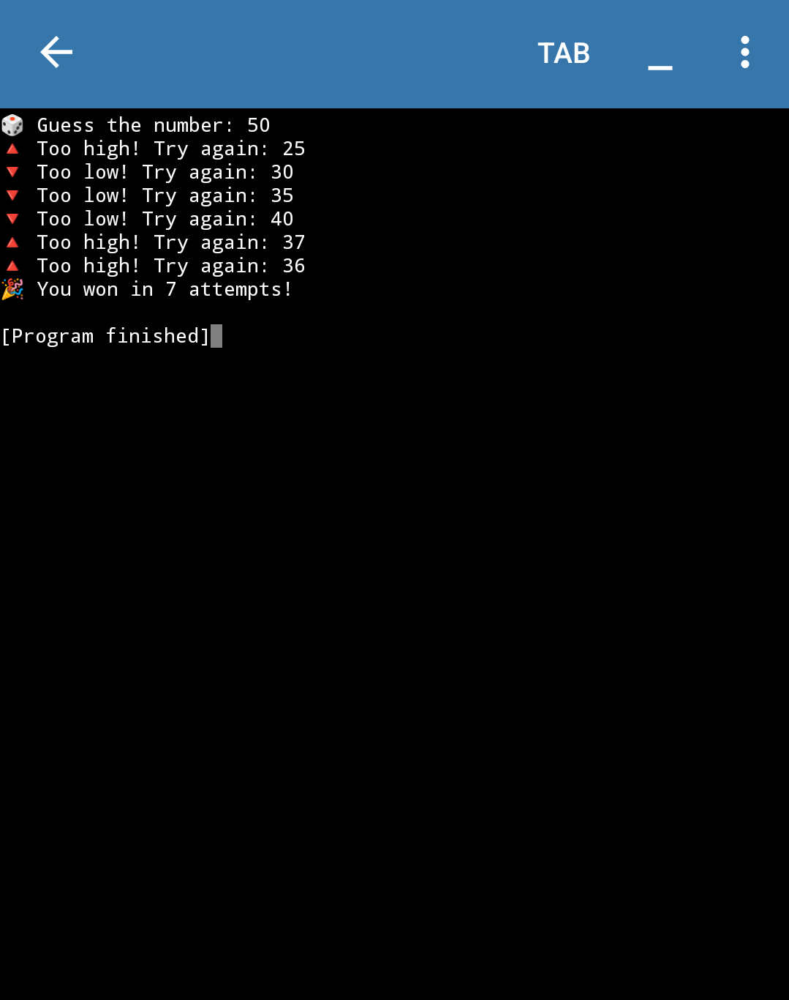
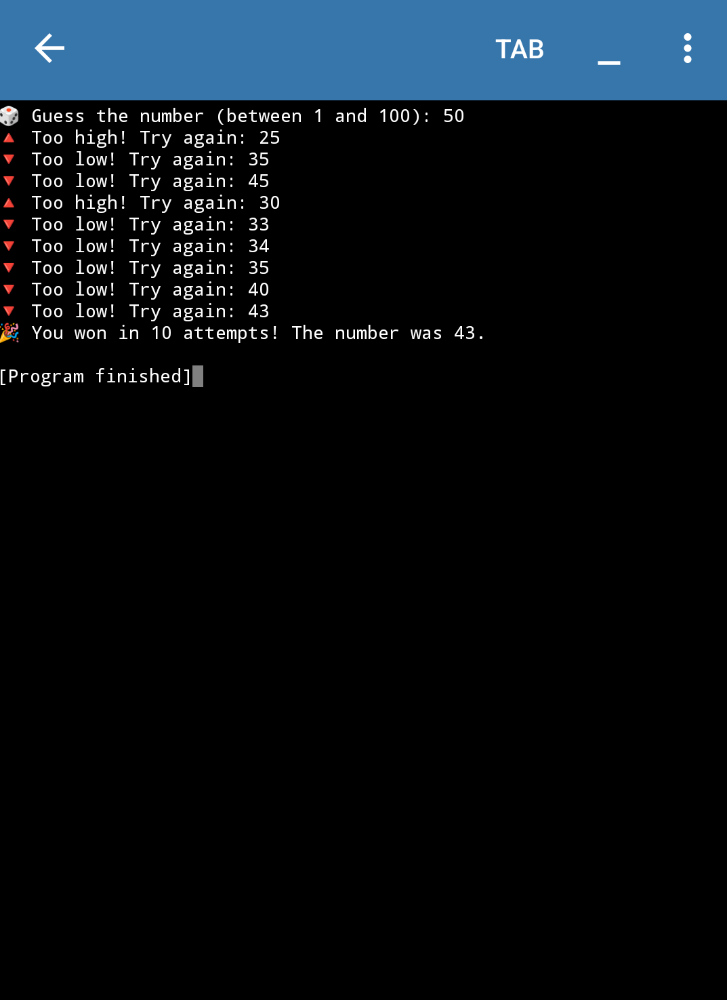

# 🎯 Guess the Number Game (Python)

This project contains **two simple versions** of a number guessing game written in Python. It's a fun way to practice conditional statements, loops, and user input.

---

## 📌 What is "Guess the Number"?

A guessing game where the user tries to guess a hidden number. After each guess, the program tells the user if the number is too low, too high, or correct.

---

## 🔢 Version 1: Hardcoded Number

- A fixed number (like 36) is hardcoded in the program.
- The user is asked to guess the number until they get it right.
- It shows how many attempts the user took.

---

## 📸 Output Screenshot

Here's the sample output of the hardcoded number guessing program:



---

## 🎲 Version 2: Random Number

- The computer randomly picks a number between 1 and 100 using the `random` module.
- The user keeps guessing until they find the correct number.
- More dynamic and realistic!

---

## 📸 Output Screenshot

Here's the sample output of the random number guessing  program:



---

## 📁 Files Included

- `guess_fixed.py` → Code with hardcoded number
- `guess_random.py` → Code with random number generation
- `images/hardcoded_guessing.png` → Screenshot for fixed version
- `images/random_guessing.png` → Screenshot for random version

---

## ▶️ How to Run

Make sure Python is installed on your system (version 3 or above).

Then open your terminal or command prompt and run:

```bash
python guess_fixed.py
```

---

## 👩‍💻 Author

Made with 💙 by **Adiba Rahman**  
📧 adibarahmanwarsiii@gmail.com  
🌐 [My Portfolio](https://adibaarahman.github.io)  
🐱‍💻 [GitHub](https://github.com/AdibaaRahman)

---

## 📜 License

This project is open-source and free to use.


